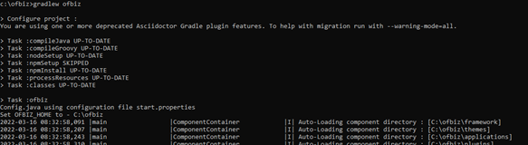

# Penjelasan Praktikum TCC Minggu-05    Latihan

- Pertama install apache ofbiz kemudian menyimpan dari dekstop ke dalam file C dengan nama folder ofbiz
<dd>

</dd>

- Masuk ke cmd ke directori folder ofbiz, lalu donwload gradle wrapper dengan  perintah “init-gradle-wrapper”  
<dd>

- Kemudian ketik perintah “gradlew cleanAll loadAll”

</dd>

- Kemudian ketika ingin memulai ofbiz ketik perintah “gradlew ofbiz”  
<dd>

- Untuk mencoba pengujiannya buka server local ofbiz  <b>https://localhost:8443/accounting</b> 

Secara otomatis akan dialihkan ke halaman login, untuk login username :  <b>admin</b> dan password : <b>ofbiz</b> .
</dd>